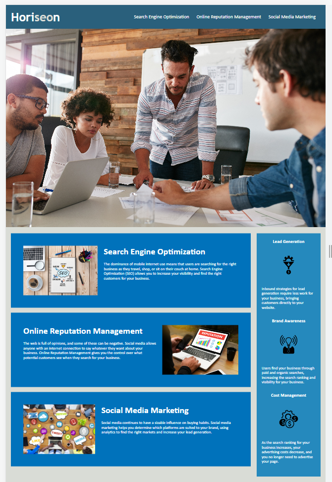

# Module 1 Challenge

## Description

The aim of this project was to refract the code provided and improve its functionality and accessability by adding semantic HTML tags as well as adding alt descriptions to all images. The starter code did not use semantic HTML, so this was addressed and the CSS code was adjusted to match these new tags. Additionally, the CSS code was neatened up, repeated code was removed and condensed and the order was adjusted to follow best practices. This project made the Horiseon website more accessable to those with disabilities. As well as this, the HTML code was debugged so that all links work.

Throughout this project I learnt a lot more about semantic HTML tags and the importance of using these to improve accessability. As well as this, refracting the CSS code helped me improve my knowledge of CSS and how to reduce repeated code by targetting multiple elements at once. 

## Installation

N/A

## Usage

To access this webpage, please use the following URL: 

The website provide information about Search Engine Optimization, Online Reputation Management and Social Media Marketing. On the right side of the webpage you can learn more about the benefits of these!

Below is a screenshot of the final webpage:

## Credits

N/A

## License

Please refer to LICENSE in repo.
